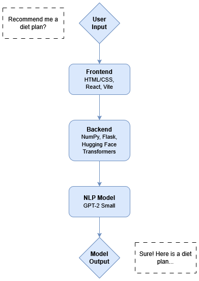

# Diaeta - A Virtual Dietician Chatbot

A lightweight dietary chatbot, powered by GPT-2 Small and trained on Q&A style prompts using NLP methodologies.

## Team name: The MahriJustinLucasTrio

- [Mahri Yalkapova](https://github.com/MahriYalkapova)
- [Justin Le](https://github.com/aujustin14)
- [Lucas Jeong](https://github.com/ljeong072)

## Introduction

**Use Case**: Dietiary chatbot to help users figure out a diet plan or by providing advice with regards to nutrition.  
**Purpose**: Streamline the process of making a meal plan, making the process much more efficient and convenient.  
**Target Users**: People struggling with dieting and nutrition and need help learning more and/or creating a viable meal plan.

## Problem Statement & Objective

Many individuals struggle to maintain a healthy diet due to factors such as limited nutritional education, lack of motivation, or restricted access to personalized dietary support. Although general nutritional guidelines are widely available, they often fail to account for individual needs, making them less effective. This chatbot aims to bridge that gap by providing accessible, personalized support to help users make healthier choices and improve their overall well-being.

## Model Selection & Justification

**Model Chosen**: GPT-2 Small
**Why GPT-2 Small?**
- Lightweight architecture with only 124M parameters 
- Fast training, fine-tuning, and deployment
- Resource-efficient, low computational costs

## Dataset & Fine-Tuning Strategy

**Datasets**:  
- [Augmented_Meal_Planner_data](https://huggingface.co/datasets/sridhar52/Augmented_Meal_Planner_data) (4,500 Q&A style prompts)
- [Nutritional-LLama](https://huggingface.co/datasets/Tom158/Nutritional-LLama) (1,490 Q & A style prompts)

**Preprocessing Steps**:
- Adjust the columns and concatenate them to create one large dataset
- Tokenized using pre-trained GPT-2 Small

**Training Details**:
- Epochs: 10 (with early stopping)
- Batch size: 16
- Learning Rate: 5e-5
- Platform: Jupyter Notebook, Visual Studio Code
- Hardware: GPU - RTX 3060 Ti

**Challenges**:
- Limited model capacity
- Data limitations
- Insufficient dataset diversity
- Generic assumptions
- Avoiding generic responses
- Balancing empathy and diversity

## System Architecture

**Components**:

- User input → Web UI (HTML/CSS + React + Vite)
- Backend → GPT-2 Small via Hugging Face
- Output → Contextual nutrition response

## Live Demo

Watch the demo: [`demo/demo_video.mp4`](demo/demo_video.mp4)  

Run locally:  
npm install node  
pip install flask  

Run simultaneously:  
python chat_server.py  
npm run dev

## React + Vite

This template provides a minimal setup to get React working in Vite with HMR and some ESLint rules.  
Currently, two official plugins are available:
- [@vitejs/plugin-react](https://github.com/vitejs/vite-plugin-react/blob/main/packages/plugin-react) uses [Babel](https://babeljs.io/) for Fast Refresh
- [@vitejs/plugin-react-swc](https://github.com/vitejs/vite-plugin-react/blob/main/packages/plugin-react-swc) uses [SWC](https://swc.rs/) for Fast Refresh

## Expanding the ESLint configuration

If you are developing a production application, we recommend using TypeScript with type-aware lint rules enabled. Check out the [TS template](https://github.com/vitejs/vite/tree/main/packages/create-vite/template-react-ts) for information on how to integrate TypeScript and [`typescript-eslint`](https://typescript-eslint.io) in your project.
